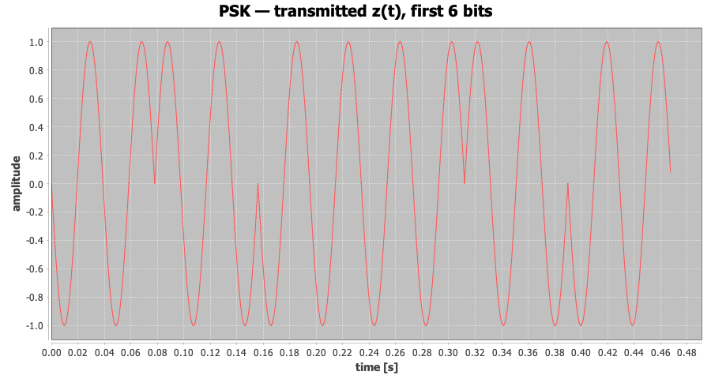
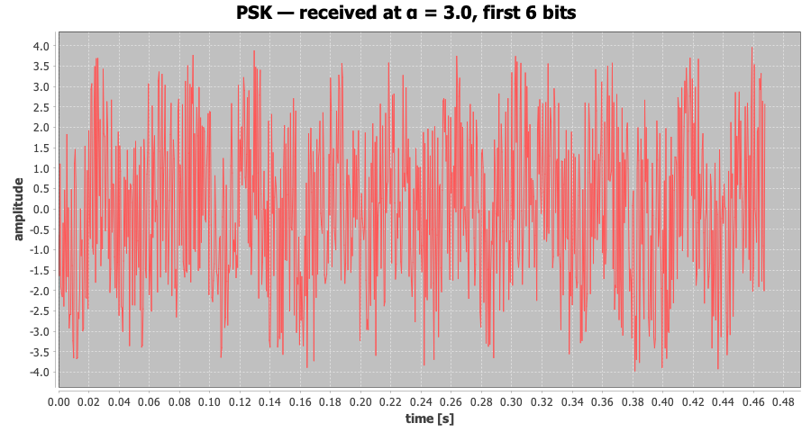
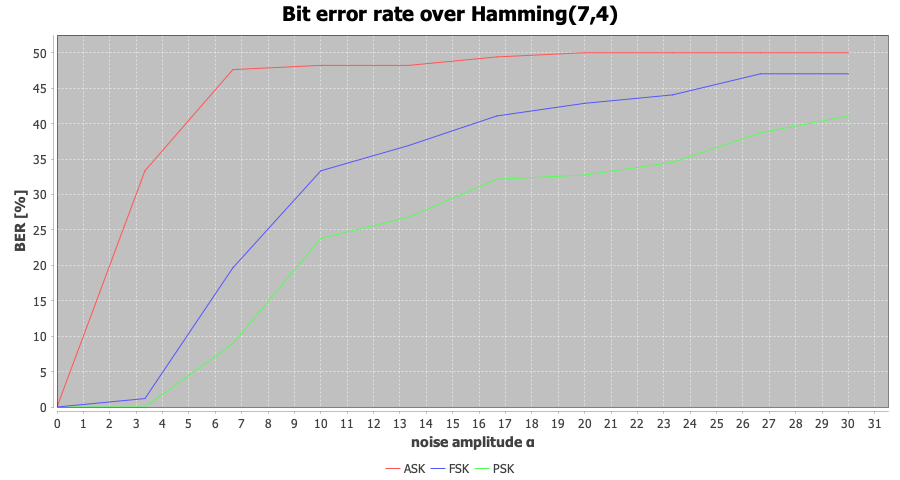
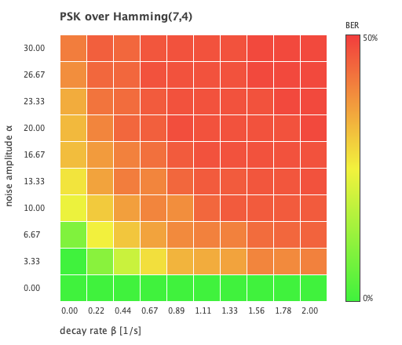

# Signal Transmission Simulator

[](https://github.com/ExeN93/signal-transmission-simulator/actions/workflows/build.yml)

A Java simulation of a complete digital radio link. It synthesises waveforms, puts a message on
a carrier, drags it through a channel that adds noise and eats the signal, and measures how much
of the message survives.

Everything is written from first principles — the FFT, the Hamming codes, the modulators and the
correlation receiver are all in this repository. The only third-party dependency is JFreeChart,
and only for drawing.

```
payload bits → Hamming code → ASK/FSK/PSK modulator → channel → correlation
             → receiver → Hamming decode → payload bits → bit error rate
```

## What it does

| Stage | Implementation |
| --- | --- |
| Waveform synthesis | sine, sawtooth, triangle and square, the last three built from truncated Fourier series |
| Spectral analysis | radix-2 FFT, amplitude and decibel spectra, occupied bandwidth at −3/−6/−10 dB |
| Error correction | Hamming(7,4) and Hamming(15,11), single-bit correction per codeword |
| Modulation | ASK, FSK and binary PSK |
| Channel | additive noise, exponential decay, linear fade to silence |
| Reception | coherent correlation detector, one integration per bit period |
| Measurement | bit error rate, one- and two-dimensional channel sweeps |

## Running it

Needs JDK 17 or newer. The Maven wrapper is included, so Maven itself is not.

```bash
./mvnw test                              # 132 tests
./mvnw compile exec:java                 # every demonstration, figures into out/
./mvnw compile exec:java -Dexec.args="ber docs/img"
```

Commands: `waveforms`, `spectra`, `transmission`, `ber`, or `all` (default). The second argument
is the output directory. Charts are written straight to PNG, so no display is needed.

## What comes out

**The receiver reads a message it cannot see.** On the left, six bits of BPSK as transmitted. On
the right, the same six bits after a channel adding noise at three times the carrier amplitude —
and the decoder still returns `"Signal"` without a single bit error.

| Transmitted | Received at α = 3 |
| --- | --- |
|  |  |

That is what integrating over a whole bit period buys: noise uncorrelated with the carrier
averages towards zero over the period, while the wanted signal accumulates.

**How the three schemes hold up.** Sending `"Signal"` repeatedly over Hamming(7,4):

| Scheme | clean | α = 3 | α = 12 |
| --- | --- | --- | --- |
| ASK | `"Signal"`, 0.0 % | `"SGfao"`, 16.7 % | `"ZChg."`, 38.1 % |
| FSK | `"Signal"`, 0.0 % | `"Signal"`, 0.0 % | `"S][nv\|"`, 28.6 % |
| PSK | `"Signal"`, 0.0 % | `"Signal"`, 0.0 % | `"Qeglad"`, 11.9 % |

ASK gives way first, and for a structural reason: both of its symbols correlate positively
against the carrier and differ only in magnitude, so the receiver has to guess a decision level
somewhere between them. PSK puts its two symbols as far apart as they can get — same waveform,
opposite sign — so zero is the natural decision level and no amplitude estimate is needed.



**Noise against attenuation.** Sweeping both at once shows which one a scheme minds more. Green
is a clean link, red is a broken one; the boundary between them is the interesting part.



## Design notes

A few decisions that are easy to get wrong, and what this implementation does instead.

**Bit periods are snapped to whole samples.** The nominal period `Tc/B` is almost never an exact
number of samples. The modulator lays bits out on the sample grid regardless, so an unsnapped
period leaves the carrier phase creeping a little at every bit boundary — far enough over a long
message to eat measurably into the correlator output. `Settings.samplesPerBit` rounds first and
derives the bit duration and the carrier frequencies from the rounded value, which keeps a whole
number of carrier periods in every bit.

**Attenuation is applied before noise.** That is the physical order: the medium weakens what was
transmitted, and the noise the receiver picks up afterwards does not shrink with it. Adding
noise first and attenuating the sum would quietly improve the signal-to-noise ratio the further
the signal had travelled.

**The ASK receiver is not told the answer.** Its decision level is the midpoint of the observed
correlator range, not a value computed from the amplitudes that were actually sent. Deriving it
from the transmitted bits would flatter the error rate — which is exactly the measurement this
project exists to make.

**Hamming(15,11) beats Hamming(7,4) here, and not because it is a stronger code.** Both correct
one bit per codeword, and (15,11) spreads that protection over a longer word, so on paper it
should do worse. It wins because its higher rate puts fewer bits on the wire for the same
payload; with the transmission time fixed, each bit gets a longer period, and the correlator
gets more to integrate. The code rate shows up as detection gain.

**The FFT pads rather than refuses.** Radix-2 needs a power-of-two length, so signals are
zero-padded to one. `Spectrum` derives the bin frequencies from the padded length, because the
resolution after padding is not the one the caller would assume from the sample count.

## Tests

132 JUnit 5 tests, no mocking framework — the interesting parts of a DSP pipeline are pure
functions, which is exactly what property-style tests want.

```bash
./mvnw test
```

What they pin down:

- **Hamming codes** — every payload round-trips; a bit flipped at *every one* of the 7 and 15
  positions in every codeword is repaired (parameterised over code × position); two errors in
  one codeword are *not* repaired, because a single-error-correcting code should not pretend
  otherwise.
- **Modulation** — ASK, FSK and PSK all round-trip over a noiseless channel; ASK varies
  amplitude only, FSK moves the spectral peak between its two tones, PSK inverts the waveform
  sample for sample.
- **Channel** — a perfect channel is the identity; the same seed reproduces the same noise;
  noise stays inside the amplitude it was given; attenuation does not shrink the noise floor.
- **End to end** — a clean link is lossless for every scheme × code combination; PSK beats ASK
  under noise; a sweep starts at zero and degrades; noisy runs are reproducible from a seed.
- **Spectrum** — a pure tone peaks at its own frequency and reports amplitude 1; a square wave
  shows odd harmonics and nothing at the even ones; occupied bandwidth widens as the threshold
  relaxes.

## Layout

```
src/main/java/pl/zwirko/signals/
├── core/            Signal, SignalGenerator, Spectrum (FFT), Bits
├── coding/          ErrorCorrectingCode, BlockCode, Hamming74, Hamming1511
├── transmission/    Modulator, Demodulator, Channel, Transmission, BerAnalyzer
├── charts/          Charts (JFreeChart), BerHeatmap (Graphics2D)
└── Main.java        command line entry point
```

`Signal` carries its sampling rate with its samples. That is deliberate: every stage needs the
rate to turn a sample index back into a time instant, and passing it around as a loose `double`
beside a bare array is how sample rates end up mismatched.

## Origins

This grew out of a university course on data transmission, where the material was spread across
thirteen separate lab exercises. This repository is a rewrite: one project, named after what the
classes actually do, with the maths pulled out of the plotting code and covered by tests.

## Licence

MIT — see [LICENSE](LICENSE).
